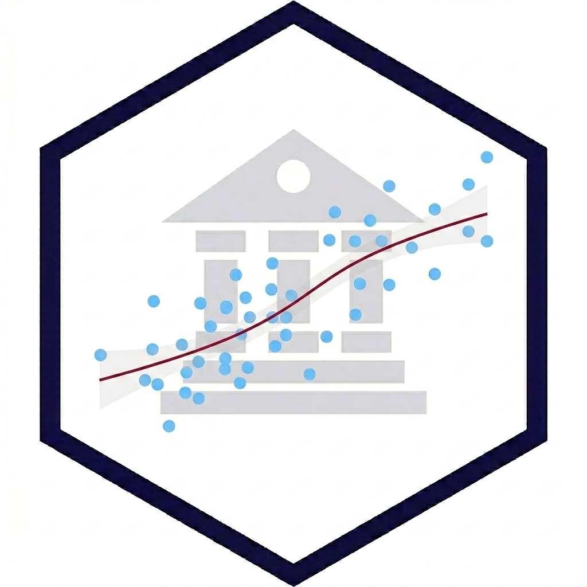
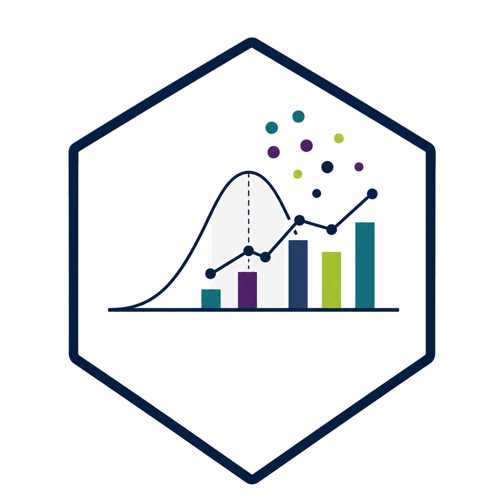

A continuación, se listan los cursos que he dictado a nivel de postgrado universitario

::: {.teaching}
## Análisis de Datos y Estadística Computacional -- UAI

::: columns
::: {.column width="15%"}
{width=90}
:::
::: {.column width="85%"}
**Versiones:** [2026](), [2024]()

Herramientas de ciencia de datos e IA para analizar problemas públicos. La primera parte del curso se centra en el proceso estándar de manipulación y análisis de información. La segunda parte introduce el análisis estadístico con R.
:::
:::

## Nivelación Estadística -- UAI
::: columns
::: {.column width="15%"}
{width=90}
:::
::: {.column width="85%"}
**Versiones:** [2025]()

El objetivo de este módulo es introducir los conceptos básicos de probabilidad y estadística mediante la ejecución de código en lenguaje R. 

Al finalizar este curso, las y los estudiantes serán capaces de emplear estadísticas descriptivas para un conjunto de datos ordenados (tidy) y entender la importancia de la inferencia estadística para extraer conclusiones a partir de información muestral u observacional (no experimental).

Si bien la nivelación estadística es optativa, los contenidos abordados serán fundamentales para los temas tratados en el módulo 2 de Análisis de Datos y Estadística Computacional.
:::
:::

