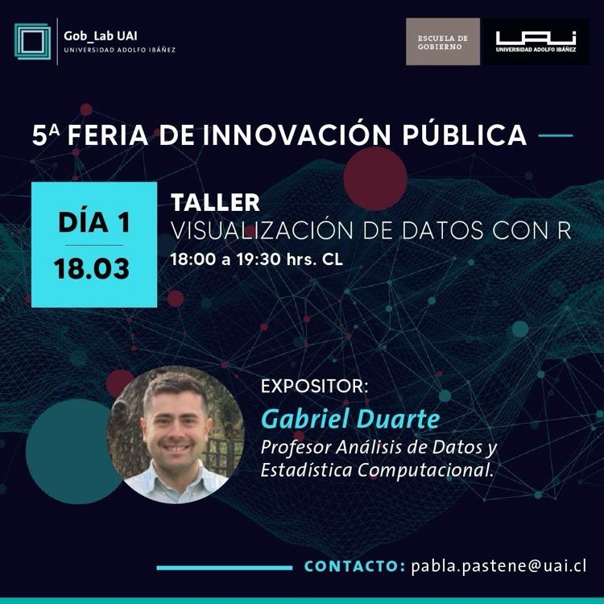

## Taller

{width=70%}

Este taller tiene como objetivo que los asistentes aprendan y
apliquen a través del lenguaje de programación `R` los conceptos
fundamentales sobre la visualización de datos, los tipos de gráficos que
se recomienda usar en función de la información disponible y algunos
consejos para comunicar resultados de manera efectiva.

Los contenidos generales del taller son:

-   La importancia de una buena visualización y sus principios.
-   Visualización con `ggplot2`.
-   Tips para un buen storytelling con datos.

## Presentación

Puedes navegar por las diapositivas directamente en el recuadro de abajo 
o hacer clic [aquí](taller-visualización-datos-2024.html){target="_blank"} 
para verla en pantalla completa. Usa las flechas de tu teclado para avanzar.

<iframe 
  src="taller-visualización-datos-2024.html" 
  width="100%" 
  height="500px"
  style="border: 1px solid #dee2e6; border-radius: 5px;">
</iframe>

### Revive el Taller Aquí

<iframe width="560" height="315" 
  src="https://www.youtube.com/embed/XxJlvvdKFPo" 
  allowfullscreen>
</iframe>

### Links útiles

-   [Sesión Grabada](https://www.youtube.com/watch?v=XxJlvvdKFPo&t=4119s)

-   [ggplot2](https://ggplot2-book.org/)

-   [Fundamentos de Visualización de Datos](https://clauswilke.com/dataviz/)
