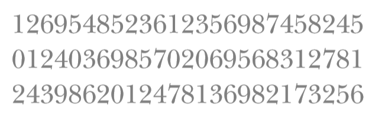
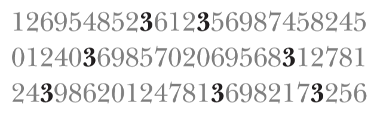
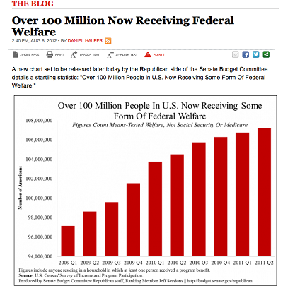
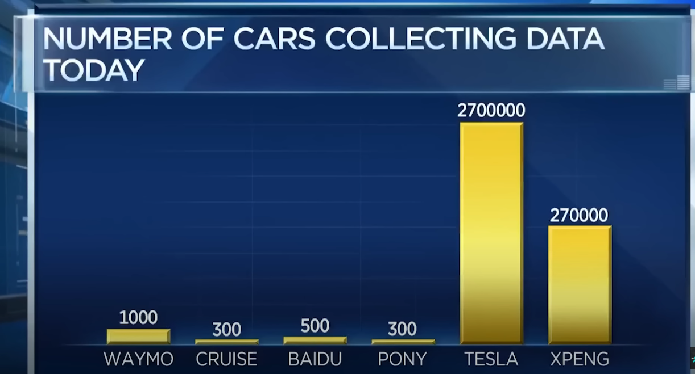
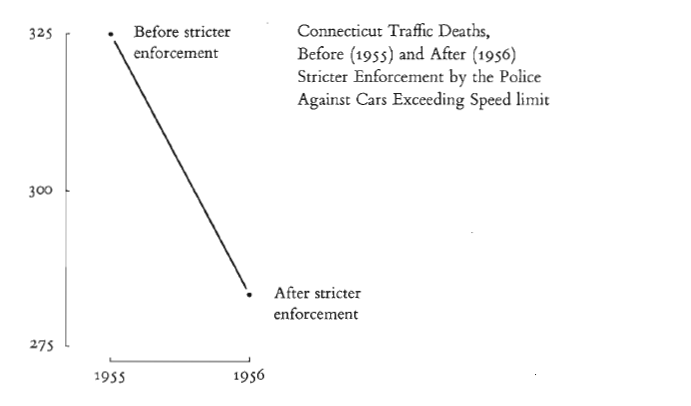
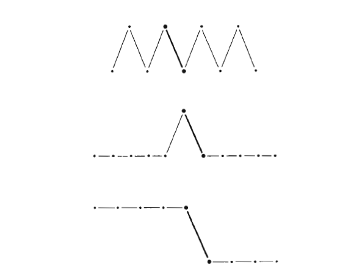
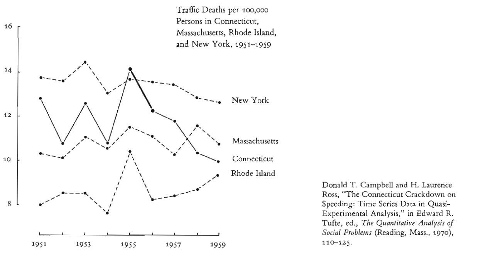
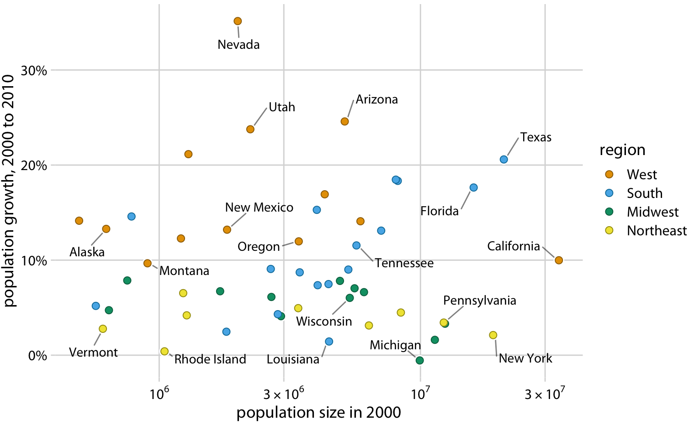
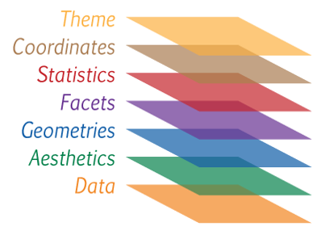
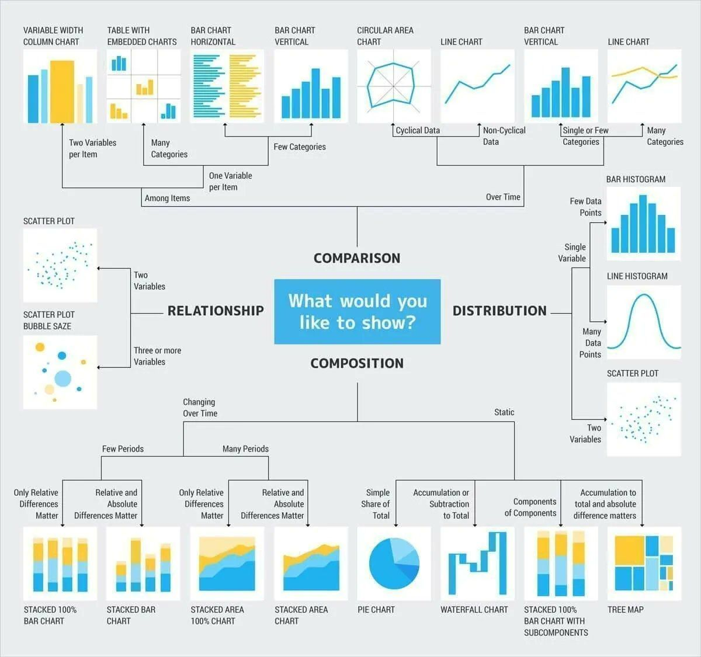

```{r setup, purl = FALSE}
#| include: false

library(knitr)
library(tidyverse)
library(vtable)
library(r2resize)
library(chilemapas)
library(palmerpenguins)
library(ggthemes)
library(plotly)
library(fBasics)
library(grid)
library(gridExtra)
library(datasets)
library(nycflights13)

```

## Objetivo {.smaller .justify}

En este taller tiene como objetivo que los asistentes aprendan y
apliquen a través del lenguaje de programación `R` los conceptos
fundamentales sobre la visualización de datos, los tipos de gráficos que
se recomienda usar en función de la información disponible y algunos
consejos para comunicar resultados de manera efectiva.

Los contenidos generales del taller son:

-   La importancia de una buena visualización y sus principios.
-   Visualización con `ggplot2`.
-   Tips para un buen storytelling con datos.

# La importancia de una buena visualización

## ¿Por qué visualizar? {.justify auto-animate="true"}

1.  [**Entender**]{style="color:#E69F00"} los datos con el fin de guiar
    análisis posteriores (análisis exploratorio).

2.  Contar una historia sobre los datos y resultados con el fin de
    [**comunicar**]{style="color:#90BE6D"} algo

## La importancia de entender los datos {.justify}

![[@samesta]](imagenes/datasaurus.gif){fig-align="center"}

::: footer
Ver:
[Datasaurus](https://www.research.autodesk.com/publications/same-stats-different-graphs/)
:::

## El cuarteto de Anscombe {.smaller .justify auto-animate="true"}

El Cuarteto de Anscombe es un conjunto de datos creado por el
estadístico británico Francis Anscombe en 1973 [@anscombe1973]. Anscombe
diseñó este conjunto de datos con el propósito de ilustrar la
importancia de la visualización en el análisis de datos y la toma de
decisiones estadísticas.

El Cuarteto de Anscombe consta de cuatro conjuntos de datos, cada uno
con 11 pares de valores (x, y). Lo notable es que, aunque los cuatro
conjuntos tienen estadísticas descriptivas idénticas (como media,
varianza y correlación), al graficarlos se revelan diferencias
significativas en su distribución y forma.

El objetivo de Anscombe al crear este conjunto de datos era destacar
cómo una **visualización** adecuada puede ser fundamental para
comprender la naturaleza de los datos y tomar decisiones informadas.

## El cuarteto de Anscombe {.smaller .scrollable transition="slide"}

::: panel-tabset
### Gráfico

```{r}
plots <- list()
dataset_names <- c("1", "2", "3", "4")

# Loop para hacer los 4 gráficos
for (i in dataset_names) {
  
plot <- ggplot(anscombe, aes_string(paste0("x", i), paste0("y", i))) +
  geom_point(color = "steelblue", size = 1.5) +
  geom_smooth(se = F, method = 'lm', col = '#FE514B') +
  # geom_smooth(se =F, col = 'red') +
  scale_x_continuous(breaks = seq(0, 20, 2)) +
  scale_y_continuous(breaks = seq(0, 12, 2)) +
  expand_limits(x = 0, y = 0) +
  labs(x = paste0("x", i), y = paste0("y", i), title = paste0("Dataset ", i)) +
  theme_bw()
  
  plots[[i]] <- plot
}

multiplot <- do.call(gridExtra::grid.arrange, c(plots, ncol = 2))
```

### Datos

```{r}
knitr::kable(anscombe)
```

### Código

```{r, echo=TRUE, eval=FALSE}
plots <- list()
dataset_names <- c("1", "2", "3", "4")

# Loop para hacer los 4 gráficos
for (i in dataset_names) {
  
plot <- ggplot(anscombe, aes_string(paste0("x", i), paste0("y", i))) +
  geom_point(color = "steelblue", size = 1.5) +
  geom_smooth(se = F, method = 'lm', col = '#FE514B') +
  # geom_smooth(se =F, col = 'red') +
  scale_x_continuous(breaks = seq(0, 20, 2)) +
  scale_y_continuous(breaks = seq(0, 12, 2)) +
  expand_limits(x = 0, y = 0) +
  labs(x = paste0("x", i), y = paste0("y", i), title = paste0("Dataset ", i)) +
  theme_bw()
  
  plots[[i]] <- plot
}

multiplot <- do.call(gridExtra::grid.arrange, c(plots, ncol = 2))
```
:::

::: footer
Ver: [Anscombe
1973](https://www.sjsu.edu/faculty/gerstman/StatPrimer/anscombe1973.pdf)
:::

## Estadística descriptiva de los 4 conjuntos {.smaller}

```{r}
st(anscombe, title = 'Estadística Descriptiva', numformat = 'decimal')
```

## El cuarteto de Anscombe {.justify}

::: callout-tip
## Mensaje Principal

**¡Confiar únicamente en medidas estadísticas resumidas sin una
visualización adecuada puede conducir a conclusiones erróneas o
incompletas!**
:::

Por eso ¡es importante **visualizar** los datos antes de empezar a
modelar!

## Lo que deberíamos buscar

-   Mostrar los datos y no mentir con estos.
    -   Contar una historia (¿una relación? ¿causalidad? ¿un patrón? ¿un
        quiebre?).
    -   Transmitir y convencer.
-   Minimizar aspectos innecesarios.
-   Visualizaciones deben complementar el texto y tener suficiente
    información para "sobrevivir por sí mismas".

## Una idea general

-   El cerebro solo puede procesar un cierto número de atributos de
    forma instantánea (*pre-attentive attributes*). Estos atributos son
    principalmente 4:
    -   Forma
    -   Posición
    -   Color
    -   Tamaño
-   Queremos buscar la variación justa en estos atributos para
    enfocarnos en lo que importa.

## ¿Cuántos 3 hay? {.nostretch auto-animate="true"}

{width="70%" fig-align="center"}

## ¿Y ahora? {.nostretch}

{width="70%" fig-align="center"}

## Algunos Principios [@tufte2001] {.smaller}

-   Muestra los datos.
-   Induce a la audiencia a pensar en lo esencial en lugar de la
    metodología, el diseño u otro atributo del gráfico.
-   Evita distorsionar lo que los datos dicen.
-   Maximiza el ratio entre datos y *tinta* (o texto).
-   Cumple un objetivo razonable y claro: Explorar, describir, etc.
-   Evita *tinta* que no corresponda a datos.
-   No ser redundante en la información.
-   Evita la *basura visual*.

::: footer
Ver: [Edward Tufte](https://www.edwardtufte.com/tufte/)
:::

## Error #1: Violar el principio de la proporcionalidad

::: callout-tip
## The principle of proportional ink

**Los tamaños de las áreas sombreadas en una visualización deben ser
proporcionales a los valores de datos que representan**
:::

En particular, este principio no se cumple en los gráficos de barra cuyo
**eje *y* no parte en 0**

<!-- ## Algunos puntos relevantes -->

<!-- - El contexto es esencial para la integridad de un gráfico -->

<!-- ## Recomendaciones para la conseguir la integridad {.smaller} -->

<!-- 1. La representación de los números como medida física de la superficie del gráfico, debe ser directamente proporcional  a las cantidades numéricas representadas -->

<!-- 2. Etiqueta los datos para evitar la distorsión gráfica y la ambigüedad. -->

<!-- 3. Muestra la variación de los datos, no en el diseño -->

<!-- 4. En series de tiempo de dinero, unidades estandarizadas de las medidas monetarias son casi siempre mejores que unidades nominales -->

<!-- 5. El número de dimensiones graficadas no debe exceder el numero de dimensiones de los datas -->

<!-- 6. Los gráficos no deben citar datos fuera de contexto. -->

## ¿Qué opinan de este gráfico? {.nostretch}

::: columns
::: {.column width="50%"}
{width="500 px"}
:::

::: {.incremental .column width="50%"}
-   La base parte en 94 M\$
-   2009 Q3 (tercera barra) parece ser casi el doble de 2009 Q1 (primera
    barra), pero en realidad son solo 2 Millones de diferencia (2% y no
    100% adicional)
:::
:::

::: footer
Ver: [Misleading
Graphs](https://www.statisticshowto.com/probability-and-statistics/descriptive-statistics/misleading-graphs/)
:::

## ¿Y de este otro gráfico?

{width="500 px"}

::: footer
Ver: [Misleading Graph
2](https://www.codeconquest.com/blog/12-bad-data-visualization-examples-explained/)
:::

## Error #2: No entregar contexto [@tufte2001] {.smaller}

-   Cuando mostramos una evolución, es importante preguntarse ¿comparado
    con qué?

{width="500 px"}

::: footer
Ver: [Tufte, E.; 2001](https://www.edwardtufte.com/tufte/)
:::

## Posibles evoluciones

{width="500 px"}

::: footer
Ver: [Tufte, E.; 2001](https://www.edwardtufte.com/tufte/)
:::

## Podría ser útil comparar con estado vecinos

{width="500 px"}

::: footer
Ver: [Tufte, E.; 2001](https://www.edwardtufte.com/tufte/)
:::

## Error #3: Mostrar mucha información

::: columns
::: {.column width="50%"}
{width="200 px"}
:::

::: {.incremental .column width="50%"}
-   En este gráfico es muy difícil relacionar los colores de la leyenda
    con los puntos en el scatter plot dada la gran cantidad de Estados [@wilke2019].
:::
:::

::: footer
Ver: [Fundamentals of Data
Visualization](https://clauswilke.com/dataviz/)
:::

## ¿Qué les parece ahora?

{width="400 px"}

::: footer
Ver: [Fundamentals of Data
Visualization](https://clauswilke.com/dataviz/)
:::

# Construyendo Visualizaciones con ggplot2

## ggplot2 {.smaller .justify}

[**¿Qué es?**]{style="color:#E69F00"}

-   Es un paquete de R para producir gráficos estadísticos que utiliza
    una gramática subyacente conocida como *gramar of graphics*, la cual
    permite componer gráficas combinando componentes **independientes**.

. . .

[**¿Para qué?**]{style="color:#0099f9"}

-   Para producir datos o gráficos estadísticos ajustados a cualquier
    problema específico.

. . .

[**¿Cuál es su ventaja?**]{style="color:#90BE6D"}

-   Permite crear gráficos novedosos.
-   Es fácil de aprender.
-   Los valores predeterminados y la lógica detrás de su gramática
    permite producir gráficos con alta calidad de publicación en
    segundos.
-   Permite trabajar iterativamente, añadiendo *capas* al gráfico,
    haciendo más fácil la transición entre una idea a un gráfico real.

## Grammar of Graphics [@wickham2009] {.smaller .justify}

::: {.column width="50%"}

:::

::: {.column .incremental width="50%"}
-   Un gráfico asigna los datos a los atributos **estéticos
    (*aesthethics*)** (color, forma, tamaño) respecto a **objetos
    geométricos (geometric objects)** (puntos, líneas, barras).
-   El gráfico también puede incluir transformaciones **estadísticas
    (*statistics*)** de los datos e información sobre el **sistema de
    coordenadas (*coordinates system*)** del gráfico.
-   El **facetado (*faceting*)** se puede utilizar para trazar
    diferentes subconjuntos de datos.
-   La combinación de estos componentes independientes son los que
    forman una gráfica.
:::

## Definiciones {.smaller .justify}

-   **Capa (Layer)**: Es una colección de elementos geométricos y
    transformaciones estadísticas. Los elementos geométricos `geom_`
    representan lo que realmente se ve en el gráfico: **puntos, líneas,
    polígonos, etc.** Las transformaciones estadísticas, para abreviar
    estadísticas, resumen los datos: por ejemplo, agrupar y contar
    observaciones para crear un histograma o ajustar un modelo lineal.

-   **Escalas (Scales)**: Asignan valores en el espacio de datos a
    valores en el espacio estético. Esto incluye el uso de ***color,
    forma o tamaño***. Las escalas también dibujan la leyenda y los
    ejes, lo que permite leer los valores de datos originales del
    gráfico.

-   **Sistema de coordenadas (Coordinate System)**: Describe cómo se
    asignan las coordenadas de los datos al plano del gráfico. También
    proporciona ejes y líneas de cuadrícula para ayudar a leer el
    gráfico. Normalmente utilizamos el sistema de coordenadas
    cartesiano, pero hay otros disponibles, incluidas coordenadas
    polares y proyecciones cartográficas.

-   **Faceta (Facets)**: Especifica cómo dividir y mostrar subconjuntos
    de datos como pequeños múltiplos

-   **Tema (Theme)** Controla los puntos más finos de visualización,
    como el tamaño de fuente y el color de fondo.

## Ejemplo Práctico

Ocupemos datos del censo 2017 para obtener la población por tramo
etario. Para ello, primero veamos la estructura de los datos que
usaremos:

## Ordenamiento de los datos

::: panel-tabset
### Código

```{r, echo=TRUE, eval=TRUE}
library(chilemapas)
poblacion_comunas <- censo_2017_comunas %>%
  group_by(codigo_comuna) %>% 
  summarise(poblacion = sum(poblacion))

cod_territoriales <- codigos_territoriales %>% 
  select(!matches("provincia")) |> 
  mutate(zona = case_when(
    codigo_region %in% c('15','01','02','03','04') ~ 'Norte',
    codigo_region %in% c('05','13','06','07','16','08') ~ 'Centro',
    .default = 'Sur'
  ))

poblacion_comunas_region <- left_join(poblacion_comunas,cod_territoriales)

poblacion_zonas <- poblacion_comunas_region |> 
  group_by(zona) |> 
  summarise(poblacion = sum(poblacion)) |> 
  mutate(porcentaje = poblacion / sum(poblacion))
# comunas_chile <- mapa_comunas %>% 
#   left_join(codigos_territoriales) %>% 
#   left_join(poblacion_comunas)

```

### Datos

```{r}
library(knitr)
knitr::kable(head(poblacion_zonas))
```
:::

## Argumentos de la función `ggplot`

::: {style="text-align: center; margin-top: 1em"}
[ggplot2](https://ggplot2.tidyverse.org/reference/){preview-link="true"
style="text-align: center"}
:::

-   `aes()`
-   `geom_`
-   `stat_`
-   `scale_`
-   `theme_`
-   `facet_`
-   `coord_`

## ¿Qué ocurre si ocupamos la función `ggplot` y solo especificamos el argumento `data`

```{r, echo=TRUE}
ggplot(data = poblacion_zonas)
```

## ¿Qué ocurre si ahora agregamos el `aesthetic` correspondiente al eje x? {.smaller}

```{r, echo=TRUE, eval=TRUE}
#| code-line-numbers: "2"
  
ggplot(poblacion_comunas_region,
       aes(x=zona))
```

## Agregemos un `geom_` para graficar un objeto geométrico {.smaller}

```{r, echo=TRUE, eval=T}
#| code-line-numbers: "2"
  
ggplot(poblacion_zonas,aes(x=zona,y=poblacion)) +
  geom_bar(stat = 'identity') #Esto es necesario cuando hacemos un gráfico de barras con 2 ejes (x e y)
```

## Ordenamos por Población y cambiamos color {.smaller}

```{r, echo=TRUE, eval=TRUE}
#| code-line-numbers: "4,5"
  
library(ggthemes)
library(scales)
library(forcats)
ggplot(poblacion_zonas,aes(x= reorder(zona,poblacion),y=poblacion))+ 
  geom_bar(stat = 'identity',fill = 'steelblue')
```

## Agregamos etiquetas a los ejes, título y subtítulo {.small .scrollable}

```{r, echo=TRUE, eval=TRUE}
#| code-line-numbers: "3-6"

ggplot(poblacion_zonas,aes(x= reorder(zona,poblacion),y=poblacion)) +
  geom_bar(stat = 'identity',fill = 'steelblue')+
  labs(title = "Población por Zona Geográfica de Chile",
    subtitle = "Censo 2017",
    x = "Zona",
    y = "Población")
```

## Agregamos etiquetas de población, cambios tema e invertimos coordenadas {.small .scrollable}

```{r, echo=TRUE, eval=TRUE}
#| code-line-numbers: "4-7"

ggplot(poblacion_zonas,aes(x= reorder(zona,poblacion),y=poblacion)) +
  geom_bar(stat = 'identity',fill = 'steelblue')+
  labs(title = "Población por Zona Geográfica de Chile",subtitle = "Censo 2017", x = "",y = "Población")+
  scale_y_continuous(labels = label_number(big.mark = "."), n.breaks = 5) +
  geom_label(aes(label = format(poblacion, big.mark = "."),fontface='bold'), vjust = .2, hjust = 1.1)+
  theme_clean(base_size = 15)+
  coord_flip()
```

## Ahora como porcentaje del total {.small .scrollable}

```{r, echo=TRUE, eval=TRUE}
#| code-line-numbers: "4-7"

ggplot(poblacion_zonas,aes(x= reorder(zona,porcentaje),y=porcentaje)) +
  geom_bar(stat = 'identity',fill = 'steelblue')+
  labs(title = "Población por Zona Geográfica de Chile (% del Total)",subtitle = "Censo 2017", x = "",y = "Población")+
  scale_y_continuous(labels = scales::percent_format(), n.breaks = 5) +
  geom_label(aes(label = scales::percent(porcentaje, accuracy = 0.1)),fontface='bold', vjust = .2, hjust = 1.1)+
  theme_clean(base_size = 15)+
  coord_flip()
```

## Tipos de visualización segun el tipo de dato

-   Existen distintas formas de clasificar las diferentes formas de
    visualizar los datos, ya sea por el **tipo de dato** que se posee, o
    bien por el **objetivo** que busque a través de la visualización.

-   En la siguiente tabla, se muestra de manera simplificada una
    combinación de datos disponibles y los objetos geométricos /
    gráficas que se recomienda utilizar para cada una de ellas:

## Tipos de visualización segun el tipo de dato {.smaller}

| Cantidad de Variables | Tipo de Variable            | Geom Recomendado                                            |
|------------------|------------------|-----------------------------------|
| 1                     | Categórica                  | `geom_bar(),ggpie(),geom_treemap()`                         |
| 1                     | Cuantitativa                | `geom_histogram(),geom_density()`                           |
| 2                     | Categórica y Categórica     | `geom_bar(position = c('stack','dodge'),`                   |
| 2                     | Cuantitativa y Cuantitativa | `geom_point(), geom_line()`                                 |
| 2                     | Categórica y Cuantitativa   | `geom_bar(stat = 'identity'),geom_density(),geom_boxplot()` |

## Y muchas más opciones en función del objetivo

{fig-align="center"
style="border: 3px solid #dee2e6;" width="780"}

## Scatterplot Avanzado {.smaller}

```{r, echo=TRUE, eval=TRUE}
#| output-location: column
#| fig-asp: 1

library(ggplot2)
data(Salaries, package="carData")

ggplot(Salaries, 
       aes(x = yrs.since.phd,
           y = salary,
           color = rank)) +
  geom_point(alpha = .4,size=3) +
  geom_smooth(se=FALSE,method="lm",
              formula=y~poly(x,2), size = 1.5) +
  labs(x = "Años desde el Ph.D.",
       title = "Salario Académico por Ranking y Años de Experiencia",
       subtitle = "Salario de 9 meses para 2008-2009",
       y = "",
       color = "Ranking") +
  scale_y_continuous(label = scales::dollar) +
  scale_color_brewer(palette="Set1") +
  theme_minimal()
```

## Bar Chart agrupado {.smaller}

```{r, echo=TRUE}
ggplot(diamonds, aes(x = cut, fill = color)) + 
  geom_bar(position = "dodge")+
  scale_fill_brewer(palette = "Set2")

```

## Bar Chart segmentado o apilado {.smaller}

```{r, echo=TRUE}
#útil para comparar el porcentaje de una categoría en una variable en cada nivel de otra variable
ggplot(diamonds, aes(x = cut, fill = color)) + 
  geom_bar(position = "fill") +
  labs(y = "Proporción")+
  scale_fill_brewer(palette = "Set2")+
  theme_economist_white()
```

## Mostrar distribuciones por variable categórica: Boxplot {.smaller}

```{r, echo=TRUE}
# plot the distribution of salaries by rank using boxplots
ggplot(Salaries, aes(x = rank, y = salary)) +
  geom_boxplot(fill = "cornflowerblue", 
               alpha = .7) +
  labs(title = "Distribución del salario por tipo de profesor")+
  theme_bw()
```

## Mostrar distribuciones por variable categórica: Density plot {.smaller}

```{r, echo=TRUE}
ggplot(Salaries, aes(x = salary, fill = rank)) +
  geom_density(alpha = 0.6) +
  labs(title = "Distribución del salario por tipo de profesor")+
  theme_classic()
```

# Ejercicios Prácticos

## 1: Histograma Expectativa de Vida {.smaller .nonincremental}

-   Utilice el siguiente `data.frame` de `gapminder`[@jennifer2023] para
    realizar un histograma de la expectativa de vida de los países.
    Rellene de color azul las barras y divídalas en 80 Por último, añada
    un tema distinto al que entrega por defecto

. . .

```{r, echo=TRUE, eval=FALSE}
library(gapminder)
library(ggplot2)
library(dplyr)

data(gapminder)

ggplot(gapminder,
       aes(x = ***))+
  geom_histogram(color = 'darkblue',*** = 'cornflowerblue', bins = ***)+
  scale_y_continuous(labels = scales::label_number(big.mark = ".")) +
  scale_x_continuous(labels = scales::label_number(big.mark = ".", accuracy = 1)) +
  theme_***()

```

## Solución {.smaller}

```{r, echo=TRUE}
library(gapminder)
library(ggplot2)
library(dplyr)

data(gapminder)
ggplot(gapminder,
       aes(x = lifeExp))+
  geom_histogram(color = 'darkblue',fill = 'cornflowerblue', bins = 80)+
  scale_y_continuous(labels = scales::label_number(big.mark = ".")) +
  scale_x_continuous(labels = scales::label_number(big.mark = ".", accuracy = 1)) +
  theme_minimal()
```

## 1.2: Histograma Expectativa de Vida {.smaller .nonincremental}

Ahora grafique 2 histogramas en el mismo gráfico pero separado por el
continente `Africa` y `Americas`. Mejore las etiquetas del eje x, y, la
leyenda y aumente el tamaño del gráfico ¿Qué puede concluir?

```{r, echo=TRUE, eval=FALSE}
ggplot(gapminder |> filter(continent %in% c('Americas', 'Africa')),
       aes(x = lifeExp, fill = ***))+
  geom_histogram(color = 'black', bins = 80)+
  labs(x = ***,
        y = ***,
        *** = 'Continente') +
scale_y_continuous(labels = scales::label_number(big.mark = ".")) +
  scale_x_continuous(labels = scales::label_number(big.mark = ".", accuracy = 1))+
  theme_minimal(*** = 15)

```

## Solución 1.2 {.smaller}

```{r, echo=TRUE}
ggplot(gapminder |> filter(continent %in% c('Americas', 'Africa')),
       aes(x = lifeExp, fill = continent))+
  geom_histogram(color = 'black', bins = 80)+
  labs(x = 'Expectativa de Vida',
        y = 'Cantidad de Países',
        fill = 'Continente') +
scale_y_continuous(labels = scales::label_number(big.mark = ".")) +
  scale_x_continuous(labels = scales::label_number(big.mark = ".", accuracy = 1))+
  theme_minimal(base_size = 15)

```

## 2: Salario por sexo {.smaller .nonincremental}

-   Utilizando el dataset `Salaries` ajuste una **RECTA** entre el
    salario y los años desde el doctorado para cada sexo ¿Qué puede
    desprender ahora del gráfico? *Pista: Fíjese en los valores usados
    para el `aesthetic` para cambiar la disposición objetos geométricos
    y en el `geom_smooth` para el ajuste de una recta*

. . .

```{r, echo=TRUE, eval=FALSE}
#| code-line-numbers: "8"
library(ggplot2)
data(Salaries, package="carData")
head(Salaries)

ggplot(Salaries, 
       aes(x = yrs.since.phd,
           y = salary,
           color = ***)) +
  geom_point(alpha = .4,size=3) +
  geom_smooth(se=FALSE,method=***, size = 1.5) +
  labs(x = "Años desde el Ph.D.",
       title = "Salario Académico por *** y Años de Experiencia",
       subtitle = "Salario de 9 meses para 2008-2009",
       y = "",
       *** = ***) +
  scale_y_continuous(label = scales::dollar) +
  scale_color_brewer(palette="Set1") +
  theme_minimal()
```

## Solución {.smaller}

```{r, echo=TRUE, eval=TRUE}
#| output-location: column
#| fig-asp: 1

(s2 <- ggplot(Salaries, 
       aes(x = yrs.since.phd,
           y = salary,
           color = sex)) +
  geom_point(alpha = .4,size=3) +
  geom_smooth(se=FALSE,method="lm",
              # formula=y~poly(x,2),
              size = 1.5) +
  labs(x = "Años desde el Ph.D.",
       title = "Salario Académico por Sexo y Años de Experiencia",
       subtitle = "Salario de 9 meses para 2008-2009",
       y = "",
       color = "Sexo") +
  scale_y_continuous(label = scales::dollar) +
  scale_color_brewer(palette="Set1") +
  theme_minimal()
)

```

# Extensiones de visualización

## Agregar interactividad {.small}

```{r, echo=TRUE}
library(plotly)
ggplotly(s2)
```

::: footer
Ver: [Plotly](https://plotly.com/graphing-libraries/)
:::

## Mapas estáticos

```{r, echo=TRUE, eval=FALSE}
options(scipen = 999)
# install.packages("devtools")
# devtools::install_github("yutannihilation/ggsflabel")
library(ggsflabel)

comunas_santiago <-  mapa_comunas |> 
  filter(codigo_region == 13) %>% 
  left_join(poblacion_comunas_region, join_by('codigo_comuna'))

ggplot(comunas_santiago) + 
  geom_sf(aes(fill = poblacion, geometry = geometry)) +
  geom_sf_label_repel(data = (comunas_santiago |> slice_max(poblacion, n = 5)), aes(label = nombre_comuna, geometry = geometry)) +
  scale_fill_distiller(palette= "YlOrRd", direction = 1,name = "Población Comunal",labels = scales::label_number(big.mark = "."))+
  labs(title = "Poblacion Comunas de Santiago") +
  theme_minimal(base_size = 13)
```

## Mapas estáticos

```{r, echo=FALSE, eval=TRUE}
options(scipen = 999)
# install.packages("devtools")
# devtools::install_github("yutannihilation/ggsflabel")
library(ggsflabel)

comunas_santiago <-  mapa_comunas |> 
  filter(codigo_region == 13) %>% 
  left_join(poblacion_comunas_region, join_by('codigo_comuna'))

ggplot(comunas_santiago) + 
  geom_sf(aes(fill = poblacion, geometry = geometry)) +
  geom_sf_label_repel(data = (comunas_santiago |> slice_max(poblacion, n = 5)), aes(label = nombre_comuna, geometry = geometry)) +
  scale_fill_distiller(palette= "YlOrRd", direction = 1,name = "Población Comunal",labels = scales::label_number(big.mark = "."))+
  labs(title = "Poblacion Comunas de Santiago") +
  theme_minimal(base_size = 13)
```

## Mapas interactivos

```{r}
crs_latlon <- "+proj=longlat +datum=WGS84 +no_defs"

comunas_santiago_leaflet <- st_as_sf(comunas_santiago) |> 
  st_transform(crs = crs_latlon)

library(leaflet)

m <- leaflet(comunas_santiago_leaflet) %>%
  addTiles(group = "OSM (default)")

bins <- seq(100000,500000,100000)
pal <- leaflet::colorBin("YlOrRd", domain = comunas_santiago_leaflet$poblacion)

labels <- sprintf(
  "<strong>%s</strong><br/>%g Poblacion",
  comunas_santiago_leaflet$nombre_comuna, comunas_santiago_leaflet$poblacion
) %>% lapply(htmltools::HTML)

m %>% addPolygons(
  fillColor = ~pal(poblacion),
  weight = 2,
  opacity = 1,
  color = "white",
  dashArray = "3",
  fillOpacity = 0.7,
  highlightOptions = highlightOptions(
    weight = 5,
    color = "#666",
    dashArray = "",
    fillOpacity = 0.7,
    bringToFront = TRUE),
  label = labels,
  labelOptions = labelOptions(
    style = list("font-weight" = "normal", padding = "3px 8px"),
    textsize = "15px",
    direction = "auto")) |> 
  addLegend(pal = pal, values = ~poblacion, opacity = 0.7, title = NULL,
  position = "bottomright")
```

## Tasa de Homicidios 2023

```{r}
crs_latlon <- "+proj=longlat +datum=WGS84 +no_defs"
library(readxl)
library(leaflet)

homicidios <- read_excel('Datos/tasa_homicidios_comunal.xlsx') |> 
  filter(Comuna!='País') |> 
  rename(tasa_2023 = `2023`) |> 
  mutate(cod = as.character(cod))
comunas_santiago2 <- left_join(comunas_santiago,homicidios, join_by('codigo_comuna' == 'cod')) |> 
  select(codigo_comuna, nombre_comuna, tasa_2023, geometry) |> 
  mutate(tasa_2023 = round(tasa_2023,2))

comunas_santiago_leaflet <- st_as_sf(comunas_santiago2) |> 
  st_transform(crs = crs_latlon)

m <- leaflet(comunas_santiago_leaflet) %>%
  addTiles(group = "OSM (default)")

bins <- seq(0,10,1)
pal <- leaflet::colorBin("YlOrRd", domain = comunas_santiago_leaflet$tasa_2023)

labels <- sprintf(
  "<strong>%s</strong><br/>%s Homicidios c/100.000 hab.",
  comunas_santiago_leaflet$nombre_comuna, comunas_santiago_leaflet$tasa_2023
) %>% lapply(htmltools::HTML)

m %>% addPolygons(
  fillColor = ~pal(tasa_2023),
  weight = 2,
  opacity = 1,
  color = "white",
  dashArray = "3",
  fillOpacity = 0.7,
  highlightOptions = highlightOptions(
    weight = 5,
    color = "#666",
    dashArray = "",
    fillOpacity = 0.7,
    bringToFront = TRUE),
  label = labels,
  labelOptions = labelOptions(
    style = list("font-weight" = "normal", padding = "3px 8px"),
    textsize = "15px",
    direction = "auto")) |> 
  addLegend(pal = pal, values = ~tasa_2023, opacity = 0.7, title = 'Tasa de Homicidios 2023',
  position = "bottomright")
```

## Resaltar objetos geométricos {.smaller}

```{r, echo=TRUE}
library(gghighlight)
library(gapminder)
data(gapminder)

ggplot(gapminder |> filter(continent == 'Americas')) +
  geom_line(aes(year, lifeExp, colour = country), linewidth = 2) +
  theme_minimal()

```

## Resaltar objetos geométricos {.smaller}

```{r, echo=TRUE}
#| code-line-numbers: "3"

ggplot(gapminder |> filter(continent == 'Americas')) +
  geom_line(aes(year, lifeExp, colour = country), linewidth = 2) +
  gghighlight(country == 'Chile')+
  theme_minimal()

```

# Contar una Historia

## ¿Qué es una historia? [@schimel2012] {.smaller}

-   La mayor parte de la visualización de datos se realiza con el fin de
    [**comunicar**]{style="color:#32CD32"} algo.
-   Una historia es un conjunto de observaciones, hechos o eventos,
    verdaderos o inventados, que se presentan en un orden específico de
    manera que crean una reacción [**emocional**]{style="color:#D70040"}
    en la audiencia.
-   La reacción emocional se crea mediante la acumulación de **tensión**
    al comienzo de la historia seguida de algún tipo de resolución hacia
    el final de la historia.
-   Es importante tener un *arco narrativo* claro e identificable (flujo
    que va desde la tensión hasta la resolución).

## ¿Qué factores son relevantes? **SUCCES:** {.smaller}

1.  **S**imple: Las ideas **simples** contienen el mensaje principal y
    la esencia en una manera sencilla y compacta.
2.  **U**nexpected: Contar ideas o resultados **novedosos**. Identificar
    una brecha de conocimiento genera curiosidad. Llenar ese vacío, crea
    novedad.
3.  **C**oncrete: Los datos son concretos pero las ideas son abstractas.
    El desafío consiste en combinar la dificultad de la abstracción con
    lo concreto de los datos para poder comunicar algo importante y que
    tenga sustento.
4.  **C**redible: Ganamos credibilidad de nuestras conclusiones
    mostrando que están sustentadas en **datos** y si éstos, a su vez,
    fueron utilizados bajo una **metodología** robusta, presentados de
    forma **clara** y ocupando **estadísticas apropiadas**.
5.  **E**motional: En lugar de preguntar ¿Qué información voy a
    presentar? se debe cambiar el enfoque a ¿Qué conocimiento puedo
    entregar?. Es importante **motivar** a la audiencia con su historia.
6.  **S**tories: Para contar bien la historia hay que pensar bien cuál
    es: Pensar bien la **estructura** interna y cómo integrar los
    distintos componentes de ella.

::: footer
Ver: [Schimel, J.;
2011](https://global.oup.com/academic/product/writing-science-9780199760244?cc=cl&lang=en&)
:::

## Algunas estrategias para contar historias {.smaller}

-   Opening--Challenge--Action--Resolution.

    -   Introducir un tópico relevante o llamativo.
    -   Presentar un desafío o evento de interés.
    -   Presentar una acción relevante que desarrolla la historia.
    -   Resultados finales.

-   Lead--Development--Resolution o Lead--Development:

    -   Revelar el punto principal desde el principio y el material
        posterior proporciona más detalles.
    -   Entregar una descripción más profunda de aspectos relevantes de
        la temática.

-   Action--Background--Development--Climax--Ending

. . .

y más ...

## Plan para construir una historia con datos

1.  Planifica y dibuja un punto final.
2.  Simula y considera esos datos simulados.
3.  Adquiere y prepara los datos reales.
4.  Explora y comprende los datos reales.
5.  Comparte lo que se hizo y lo que se encontró.

::: footer
Ver: [Telling Stories With Data](https://tellingstorieswithdata.com/)
:::

## ¡Inscripciones al resto de talleres!

{fig-align="center"
style="border: 3px solid #dee2e6;" width="780"}

# Bibliografía
